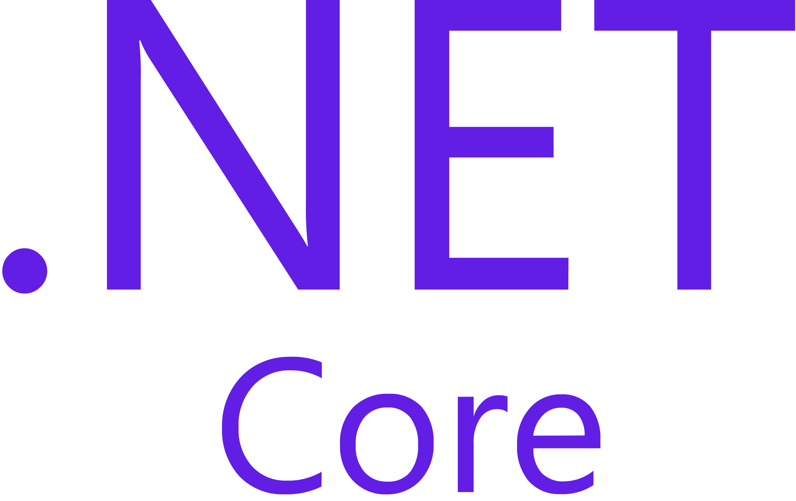

<h1 align="center">
  
</h1>

<h5 align="center">
  <code><a href="https://www.linkedin.com/in/osmandurdag/" title="LinkedIn Profile"> LinkedIn</a></code>
</h5>
 

  Hola, Hi, Hallo, Bonjour! Soy Alex Burcea, Analista de Datos, Desarrollador de Páginas Web & Software, con un toque de Ciberseguridad
   
   
  🔬 Actualmente me encuentro estudiando una FP en Desarrollo de Aplicaciones Multiplataforma & una Ingeniería Electrónica y de Sistemas Embebidos
   
  🎓 Me gradué en Tajamar en Programación .NET &
   
  🎓  Certificación Profesional de Nivel 3 en Programación Orientada a Objetos y Bases de Datos Relacionales &
   
  🎓 Varias certificaciones en Ciberseguridad (CISCO.)
   
  💻 Me encanta escribir y crear soluciones a problemas con mi código
   
  📚 Actualmente me estoy enfocando en expandir mi red de proyectos fuera del entorno estudiantil
   
  💬 Pregúntame cualquier cosa pinchando <a href="https://github.com/alexycoding/alexycoding/issues" title="Issues">-- Aquí --</a>
   
  📫 ¿Quieres contactarme? ¡Aquí tienes! <a href="mailto: andreialex2968@yahoo.es">andreialex2968@yahoo.es</a>

<h2 align="center">🔥 Lenguajes | Frameworks | Herramientas | Habilidades 🔥</h2>
 

  <code></code>
  <code></code>
  <code></code>
  <code></code>
  <code></code>
  <code></code>
  <code></code>
  <code></code>
  <code></code>
  <code></code>
  <code></code>
  <code></code>
  <code></code>
  <code></code>
  <code></code>
  <code></code>
  <code></code>
  <code></code>
  <code></code>
  <code></code>
  <code></code>

